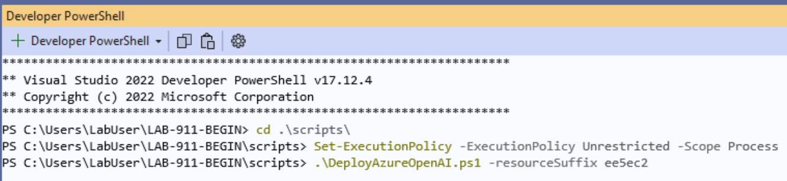
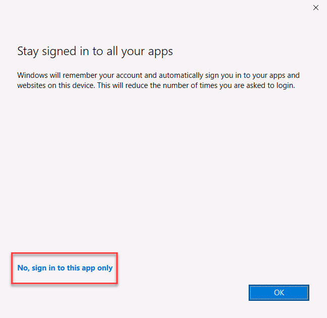
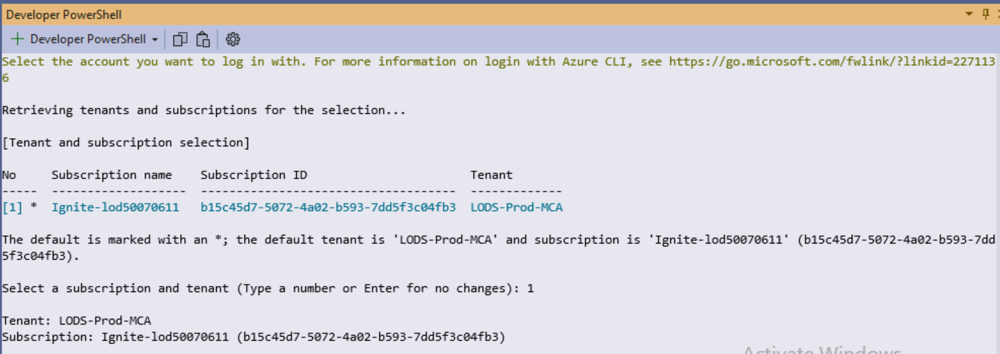
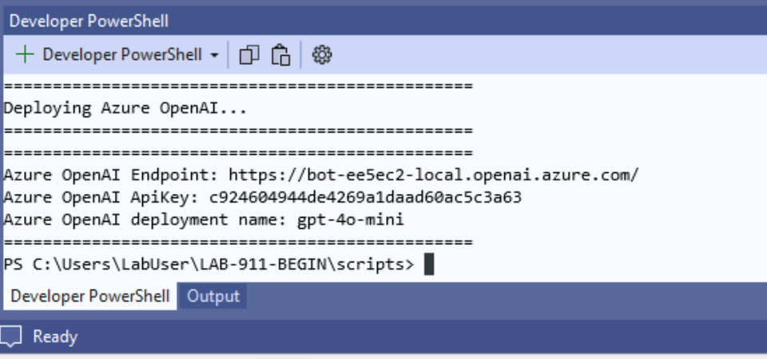

@lab.Title

Login to your VM with the following credentials...

**Username: ++@lab.VirtualMachine(Win11-Pro-Base-VM).Username++**

**Password: +++@lab.VirtualMachine(Win11-Pro-Base-VM).Password+++** 

Use this account to log into Microsoft 365:

**Username: +++@lab.CloudPortalCredential(User1).Username+++**

**Password: +++@lab.CloudPortalCredential(User1).Password+++**

<br>

---

# LAB 911 - Build Custom Engine Agents for Microsoft 365 Copilot

# Create a custom engine agent

Custom engine agents are chatbots for Microsoft Teams powered by generative AI, designed to provide sophisticated conversational experiences. Custom engine agents are built using the Teams AI library, which provides comprehensive AI functionalities, including managing prompts, actions, and model integration as well as extensive options for UI customization. This ensures that your chatbots leverage the full range of AI capabilities while delivering a seamless and engaging experience aligned with Microsoft platforms.

## What will we be doing?

Here, you create a custom engine agent that uses a language model hosted in Azure to answer questions using natural language:

- **Create**: Create a custom agent agent project and use Teams Toolkit in Visual Studio.
- **Provision**: Upload your custom engine agent to Microsoft Teams and validate the results.
- **Prompt template**: Determine the agent behaviour.
- **Suggested prompts**: Define prompts for starting new conversations.
- **Message handlers**: Run logic when recieving a specific keyword or phrase.
- **Chat with your data**: Integrate with Azure AI Search to implement Retrieval Augmentation Generation (RAG).
- **Feedback**: Collect feedback from end users.
- **Customize responses**: Customize the agent response.
- **Sensitive information**: Display sensitivity guidance to end users.
- **Content moderation**: Integrate Azure Content Safety service to detect harmful user-generated and AI-generated content.

### Step 1: Open starter project

Start with opening the starter project in Visual Studio 2022.

1. Open **Visual Studio 2022**.
1. In the Visual Studio 2022 welcome dialog, select **Continue without code**.
1. Open the **File** menu, expand the **Open** menu and select **Project/solution...**.
1. In the **Open Project/Solution** file picker, on the left hand menu, select **This PC**.
1. Double click **Local Disk (C:)**.
1. Navigate to **C:\Users\LabUser\LAB-911-BEGIN** folder.
1. In the **LAB-911-BEGIN** folder, select **Custom.Engine.Agent.sln**, then select **Open**.

### Step 2: Examine the solution

The solution contains two projects:

- **Custom.Engine.Agent**: This is an ASP.NET Core Web API project which contains your agent code. The agent logic and generative AI capabilities are implemented using Teams AI library. 
- **TeamsApp**: This is a Teams Toolkit project which contains the app package files, environment, workflow and infrastructure files. You will use this project to provision the required resources for your agent.

### Step 3: Create dev tunnel

Dev tunnels allow developers to securely share local web services across the internet. When users interact with the agent in Microsoft Teams, the Teams platform will send and receive messages (called Activities) from your agent code via the Bot Framework. As the code is running on your local machine, the Dev Tunnel exposes the localhost domain which your web api runs on as a publicly accessible URL.

Continue in Visual Studio:

1. Open the **View** menu, expand **Other windows**, and select **Dev Tunnels**.
2. Remove any existing Dev Tunnels. (Right Click | Remove)
3. In the **Dev Tunnels** pane, select the **plus (+)** icon.
4. In the dialog window, create the tunnel using the following settings:
    1. **Account**: Expand the dropdown and select **Sign in**, then select **Work or school account**, then again and select **OK**. Use the Microsoft 365 account details to sign in. In the **Stay signed in to all your apps** dialog, select **No, sign in to this app only**.
        - **Username: +++@lab.CloudPortalCredential(User1).Username+++**
        - **Password: +++@lab.CloudPortalCredential(User1).Password+++**
    2. **Name**: +++custom-engine-agent+++
    3. **Tunnel type**: Temporary
    4. **Access**: Public
5. To create the tunnel, select **OK**.
6. In the confirmation prompt, select **OK**.
7. Close the Dev Tunnels window.

## Step 4: Provision resources - Sub-step 1 of 4

Teams Toolkit help developers automate tasks using workflow files. The workflow files are YML files which are stored in the root of the TeamsApp project. 

### Step 4.1: Review Teams Toolkit provisioning tasks

Continue in Visual Studio:

1. In **TeamsApp** project, open **teamsapp.local.yml**.
1. Examine the contents of the file.

The file contains a single stage called **Provision** which contains several tasks.

1. **teamsApp/create**: Registers an app in Teams Developer Portal and writes the app ID to **env\\.env.local**.
1. **aadApp/create**: Registers an app in Microsoft Entra and writes several values to **env\\.env.local**.
1. **aadApp/update**: Applies an app manifest to the Microsoft Entra app registration.
1. **arm/deploy**: Provisions the Azure Bot Service using Bicep. It writes several values back to **env\\.env.local**.
1. **file/createOrUpdateJsonFile**: Updates **appsettings.development.json** file with environment variables which can be used by code at runtime.
1. **teamsApp/validateManifest**: Validates the app manifest file.
1. **teamsApp/zipAppPackage**: Creates the Teams app package.
1. **teamsApp/validateAppPackage**: Validates the app package.
1. **teamsApp/update**: Updates the app registration in the Teams Developer Portal.

### Step 4.2: Use Teams Toolkit to execute the tasks in the workflow file

This will be a three step process where you will 

1. Right-click **TeamsApp** project.
1. Expand the **Teams Toolkit** menu and select **Prepare Teams App Dependencies**.
1. In the **Microsoft 365 account** dialog, select the account you used to create the Dev Tunnel earlier and select **Continue**. This will start the Dev Tunnel and write the tunnel endpoint and domain to the **env\env.local** file.
1. In the **Provision** dialog, configure the resource group to be used to host the Azure Bot Service:
    1. **Subscription**: Expand the dropdown and select the subscription in the list
    1. **Resource group**: Select **New...**, enter +++rg-custom-engine-agent-local+++ the text field and then select **OK**.
    1. **Region**: Expand the dropdown and select **West US** in the list
    1. Select **Provision**
1. In the warning prompt, select **Provision**.
1. Wait for the process to complete, this can take a 1-3 minutes. Teams Toolkit will output its progress in the Output pane.
1. In the **Info** prompt, select **View provisioned resources** to open a browser.

<!-- Take a minute to examine the Azure Bot Service resource in the Azure Portal. -->

Note: This step will not complete and step with an error - this is expected. The next two steps will finish the provisioning.

### Step 4.3: Create AzureOpenAI resource and deploy the gpt-4o-mini LLM

The next step is to run a PowerShell script, which is going to deploy on your Azure subscription the two resources which are needed to run the lab:

1. Open file ```TeamsApp\env\.env.local```
2. Copy the variable RESOURCE_SUFFIX value and save it in Notepad. It should be a 6 digit number. Something like:
```RESOURCE_SUFFIX=416617```

3. Open a Terminal session in Visual Studio
4. Change to directory .\LAB-911-BEGIN\scripts
4. Right click on an empty space in File Explorer and choose **Open in Terminal**.
5. Type the following command and press Enter to enable the execution of the script:

    ```powershell
    Set-ExecutionPolicy -ExecutionPolicy Unrestricted -Scope Process
    ```

6. Run the script by typing the following command and by pressing Enter. User the resourceSuffix retrieved in the step above:

    ```powershell
    .\DeployAzureOpenAI.ps1 -resourceSuffix XXXXXX
    ```
    

7. The script will ask you to log in to your Azure subscription. If you're doing this lab at MCAPS Tech Connect, choose **Work or school account**, then use the following credentials when asked:

    - Username: +++@lab.CloudPortalCredential(User1).Username+++
    - Password: +++@lab.CloudPortalCredential(User1).Password+++
  

8. Windows will ask you if you want to stay signed in all your apps. Click on the **No, sign in to this app only** link highlighted in the image below:

    

9. You will be asked to choose a subscription. Type `1` to select the only available one and press Enter.

    

10. The script will take a few minutes to complete. Once the execution is completed, you will see a report like the following one:

    

11. Keep the terminal open. You will need these credentials later in the lab. In case you close the window by mistake, a backup copy of the credentials has been saved on your desktop in a text file named *Credentials.txt*.

### Step 4.4: Update .env.local.user with AzureOpenAI environment variables

1. Open file ```TeamsApp\env\.env.local.user```
2. The SECRET_BOT_PASSWORD will be set.
3. Copy the variable names from ```TeamsApp\env\.env.local.user.sample```
4. Complete remaining variables with the values received in the above step. 
When complete, the file should look something like:
```
SECRET_AZURE_OPENAI_API_KEY=7b3079ce470axxxxx1e7b4ff48af0857
AZURE_OPENAI_ENDPOINT=https://bot-18xxxx-local.openai.azure.com/
AZURE_OPENAI_DEPLOYMENT_NAME=gpt-4o-mini
SECRET_BOT_PASSWORD=crypto_bc219937xxx
```
### Step 4.5: Complete the provisioning 

1. Repeat **Step 4.2: Use Teams Toolkit to execute the tasks in the workflow file** above to complete the configuration of the Bot and AzureOpenAI resources. Here are the steps for convenience:

2. Right-click **TeamsApp** project.
3. Expand the **Teams Toolkit** menu and select **Prepare Teams App Dependencies**.
4. In the **Microsoft 365 account** dialog, select  **Continue**, using the account provided in a previous step. 
5. In the **Provision** dialog, click 'Provision' as these settings were set in a previous step.
6. In the warning prompt, select **Provision**.
7. Wait for the process to complete, this can take a 1-3 minutes. Teams Toolkit will output its progress in the Output pane.
8. In the **Info** prompt, select **View provisioned resources** to open a browser.

Note the created Azure Bot and Azure OpenAI created resources.
